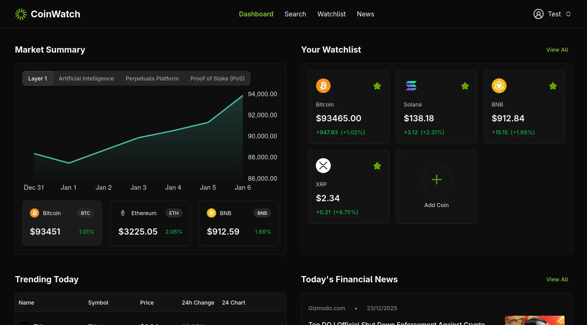

<div align="center">
  
  <h1>CoinWatch</h1>
  <p><strong>Your Ultimate Cryptocurrency Intelligence Dashboard</strong></p>

  <p>
    
    
    
    
    
  </p>
</div>

---

## 🚀 Overview

**CoinWatch** is a modern, high-performance cryptocurrency dashboard designed for real-time market monitoring and portfolio management. Built with the latest web technologies, it provides users with a seamless interface to track their favorite coins, set price alerts, and stay updated with the latest financial news.

### ✨ Key Features

- **📊 Real-time Market Summary**: Interactive charts (Lightweight Charts & Chart.js) providing deep insights into price movements.
- **⭐ Intelligent Watchlist**: 
  - **Unauthenticated Mode**: Save your favorites locally using `localStorage`.
  - **Authenticated Sync**: Seamlessly sync your local watchlist to your account upon login.
- **🔔 Advanced Alerts**: Set personalized price alerts based on specific conditions (percentage change, price thresholds, etc.).
- **🔥 Trending Coins**: Stay ahead of the curve with real-time trending data powered by the CoinGecko API.
- **🗞️ Crypto News Feed**: Integrated financial news to keep you informed about market-moving events.
- **🔐 Secure Authentication**: Robust auth system powered by **Better Auth** with support for multiple providers.
- **📱 Responsive & Dark-First UI**: A premium, minimalist dark-themed interface optimized for all devices.

---

## 🛠️ Tech Stack

### Frontend
- **Framework**: [Next.js 16](https://nextjs.org/) (App Router)
- **Library**: [React 19](https://reactjs.org/)
- **Styling**: [Tailwind CSS 4](https://tailwindcss.com/)
- **Components**: [Shadcn UI](https://ui.shadcn.com/)
- **Icons**: [Hugeicons](https://hugeicons.com/)
- **Charts**: [Chart.js](https://www.chartjs.org/) & [Lightweight Charts](https://www.tradingview.com/lightweight-charts/)

### Backend & Database
- **Runtime**: [Bun](https://bun.sh/)
- **ORM**: [Drizzle ORM](https://orm.drizzle.team/)
- **Database**: PostgreSQL
- **Authentication**: [Better Auth](https://better-auth.com/)
- **Email**: [Resend](https://resend.com/)

### State Management & APIs
- **Data Fetching**: [React Query](https://tanstack.com/query/latest)
- **Market Data**: [CoinGecko API](https://www.coingecko.com/en/api)
- **News Data**: GNews / NewsAPI

---

## 📸 Screenshots


*The main dashboard featuring market summaries, watchlist, and trending coins.*

---

## ⚙️ Getting Started

### Prerequisites

- [Bun](https://bun.sh/) (Recommended) or Node.js
- PostgreSQL database

### Installation

1. **Clone the repository**
   ```bash
   git clone https://github.com/niiithish/coin-mantra.git
   cd coinwatch
   ```

2. **Install dependencies**
   ```bash
   bun install
   ```

3. **Set up Environment Variables**
   Create a `.env` file in the root directory and add the following:
   ```env
   DATABASE_URL=your_postgresql_url
   BETTER_AUTH_SECRET=your_auth_secret
   BETTER_AUTH_URL=http://localhost:3000
   COINGECKO_API_KEY=your_api_key
   NEWS_API_KEY=your_news_api_key
   GNEWS_API_KEY=your_gnews_api_key
   ```

4. **Database Migration**
   ```bash
   bun drizzle-kit push
   ```

5. **Run the development server**
   ```bash
   bun dev
   ```

---

## 📂 Project Structure

```text
├── app/              # Next.js App Router (Pages & APIs)
├── components/       # Reusable React components
│   ├── dashboard/    # Dashboard-specific components
│   ├── ui/           # Base UI components (Shadcn)
│   └── ...
├── lib/              # Core logic, database schema, & utilities
├── hooks/            # Custom React hooks
├── public/           # Static assets
├── drizzle/          # Database migrations
└── ...
```

---

## 📄 License

This project is open-source and available under the MIT License.

---

<div align="center">
  Built with ❤️ by [Nithish](https://github.com/niiithish)
</div>
